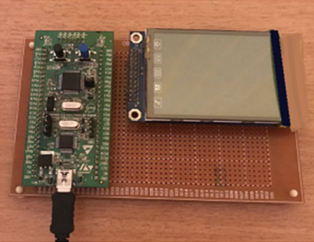
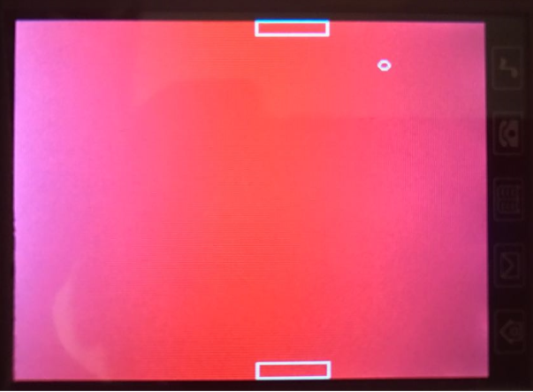

# Ping Pong Game for STM32f100 Discovery Board

Requirements:
- STM32F100 discovery board
- ILI9328 LCD 240x320 pixeli 2.8 inch with touch screen

# Install the IAR Workbench Embedded

We used SPL (Standard Peripheral Library v.3.5.0) from STM to generate the project

STM32 communication with LCD: 
- 8 pins for date (DH0, DH1, DH2, DH3, DH4, DH5, DH6, DH8);
- 6 pins for LCD (BL_CTRL, RSTH, RDH, WRH, RSH, LCD_CSH)

STM32 control the touch screen (AD7843):
- 4 pins for touch screen (MOISH, MISO, SCLKH, TC_CSH);
- 1 pin PEN.  

# ToDo

Add multitask support, one task per action:
- update_ball
- update_player_1
- update_player_2
- collision_check
- gui
